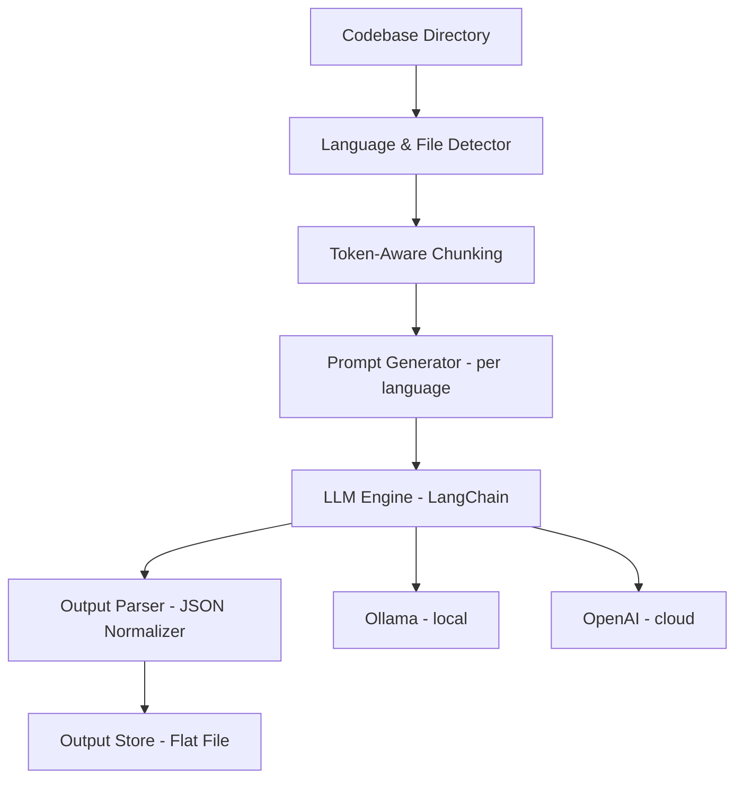

# InsightFoundry Codebase Analysis using LLMs (Assessment Prototype)

> **Note**: This implementation balances completeness with simplicity
> and focuses on modular design, LLM integration, and token efficiency rather than production-scale robustness.

## Table of Contents

- [Overview](#overview)
- [Goals and Approach](#Goals-and-Approach)
    - [Knowledge Extraction in Line with Assessment](#Knowledge-Extraction-in-Line-with-Assessment)
    - [Implementation Objectives](#Implementation-Objectives)
- [Architecture](#architecture)
    - [High-Level Flow](#High-Level-Flow)
    - [Key Design Principles](#Key-Design-Principles)
    - [Token-Aware Chunking Strategy](#Token-Aware-Chunking-Strategy)
- [Token-Aware Chunking Detailed Design](#Token-Aware-Chunking-Detailed-Design)
- [Methodology](#methodology)
- [Folder Structure](#folder-structure)
- [Tech Stack](#Tech-stack)
- [How to Run](#how-to-run)
    - [Install Requirements](#Install-Requirements)
    - [Run InsightFoundry](#Run-InsightFoundry)
    - [Sample Output](#output)
- [Improvements](#potential-improvements)
- [Referenced Repos & Justifications](#referenced-github-repositories)
- [Final Note](#final-note)

## Overview

InsightFoundry is a language-agnostic prototype that uses LLM for code analysis. It extracts structured insights from any software codebase. It summarizes source files and methods, estimates complexity, and generates consistent, machine-readable JSON outputs for later use.

The implementation is built using LangChain, with pluggable support for both OpenAI and Ollama backends. It demonstrates
effective use of:

- Prompt engineering for contextual analysis
- Token-aware chunking to manage large files
- Modular architecture for extensibility

This project was developed as part of an assessment. It focuses on correctness, clarity, and maintainability rather than production-scale engineering, such as parallelism, caching, and vector search.

>The tool name, InsightFoundry, reflects its goal of using language models' intelligence to create actionable insights from raw code.

## Goals and Approach

### Knowledge Extraction in Line with Assessment

InsightFoundry extracts structured knowledge from source code in the following forms:

- **High-level overview of project purpose and functionality**
- **Method-level metadata**: name, signature, summary, and estimated complexity
- **Other noteworthy items**: framework usage, suggestions for improvement, and security-relevant notes (when
  identifiable)
- **All extracted data is structured into machine-readable JSON** for ease of consumption and integration

### Implementation Objectives

- Analyze source code files and extract:
    - File-level summaries
    - Method/function metadata (name, signature, purpose)
    - Estimated method complexity
    - Additional insights: improvement areas, frameworks used, security concerns, etc.
- Support for **multiple programming languages** (Currently validated with **Java** and **HTML** only; framework
  supports extension to others)
- Structured output in **JSON** format
- Seamless backend switching between **OpenAI** and **Ollama**
- Modular design to enable extensibility and feature growth

> **Note**: Multi-language support is architecturally enabled but only validated with Java and HTML in this assessment
> implementation.

## Architecture

InsightFoundry follows a modular pipeline architecture optimized for LLM-driven code analysis.

### High-Level Flow



### Key Design Principles

- **Modularity**: Chunking, complexity estimation, prompt generation, and output handling are separated into clear
  modules.
- **LLM Agnosticism**: Supports both OpenAI and Ollama via a single config switch (USE_OPENAI).
- **Token-Aware Processing**: Uses LangChain's RecursiveCharacterTextSplitter to ensure chunked inputs respect token
  limits.
- **Extensibility**: Supports easy integration of features like vector stores (e.g., Pinecone), UI layers, or semantic
  linking with minimal changes.

## Methodology

1. **File & Language Detection**
    - Simple mapping of file extensions to programming languages.

2. **Code Chunking**
    - Code is split at the function or method level using regex or AST-like logic.
    - Token-aware chunking prevents LLM overflows.

3. **Prompt Construction**
    - Dynamic templates are used for summarization, signature extraction, and complexity estimation.
    - Custom prompts are tailored per language to enhance accuracy.

4. **LLM Inference (via LangChain)**
    - Interfaces with either OpenAI (for precision) or Ollama (for cost-effective local inference).
    - Responses are structured using consistent templates and parsed into normalized output.

5. **Output & Storage**
    - Results are saved as structured JSON files, grouped by file and method.

> Output format and prompt templates are designed to maximize interpretability and downstream machine-readability.

### Token-Aware Chunking Strategy

To ensure that large source files are processed effectively within the input limits of LLMs (e.g., OpenAI’s 8K/16K
context windows), InsightFoundry uses token-aware chunking. This design ensures both completeness and compliance with
model constraints.

Key Techniques:

- Token Estimation: tiktoken is used to precompute token usage from prompt templates and static inputs (e.g., file name,
  metadata).

- Dynamic Budgeting: After subtracting prompt/system tokens, the remaining token budget is used to size the code chunk.
- Overlap-Aware Chunking: Implements configurable overlap (CHUNK_OVERLAP) to maintain continuity between chunks.
- Model Flexibility: Compatible with both gpt-3.5-turbo, gpt-4, and local Ollama models like codellama.
- Fallback Safety: A minimum of 100 tokens is always reserved to prevent zero-length or broken chunks in edge cases.

Read [Token-Aware Chunking Detailed Design](#Token-Aware-Chunking-Detailed-Design) for more detailed explanation

## Token-Aware Chunking Detailed Design

Large code files can easily exceed the token limits of LLMs, especially when including structured prompts, system
messages, and code together. To mitigate this, InsightFoundry implements a robust token-aware chunking system designed
for maximum efficiency and safety.

### Why Token-Aware Chunking?

- Avoids LLM input truncation errors

- Preserves context within model limits

- Optimizes chunk size dynamically for each prompt

- Enhances continuity using overlapping regions

LLMs like OpenAI's GPT and Ollama models have strict token limits (e.g., 4K, 8K, 32K). Exceeding these limits leads to
prompt truncation or invocation failure. To address this, InsightFoundry:

- Dynamically estimates token usage for the static parts of the prompt
- Calculates a **per-file token budget** for the code portion
- Applies overlap-aware chunking for smooth context transitions

### How It Works

#### Prompt-Aware Token Budgeting

- Uses PromptTemplate.format_prompt() to simulate the full prompt excluding code.
- Measures static token cost using tiktoken.
- Subtracts this from MAX_INPUT_TOKENS (typically 8000 or 16000), with a safety buffer (e.g., BUFFER_TOKENS = 500).

#### Overlap Adjustment

- Applies a fixed CHUNK_OVERLAP to all splits, ensuring contextual carry-over between adjacent chunks.

#### Minimum Budget Enforcement

- Ensures that every chunk, no matter how small the remaining budget, contains at least 100 tokens of code.

#### Splitter Logic

- Code is split using LangChain’s RecursiveCharacterTextSplitter.

- The estimated token-per-character ratio is used to convert the token budget into chunk_size in characters.
- Adjusts dynamically per file based on file path length, chunk index, and language metadata in the prompt.

A helper function computes how many tokens are available for code per chunk:

### Example:

If chunk A ends with the first half of a method and chunk B begins with the same content, the LLM can still reason
accurately across both.
Example Calculation (GPT-3.5)

For GPT-3.5-turbo (4096 token limit):

    MAX_INPUT_TOKENS = 4096

    BUFFER_TOKENS = 500 (reserved for response)

    Prompt metadata usage ≈ 350 tokens

    CHUNK_OVERLAP = 100

Effective code token budget per chunk ≈ 4096 - 500 - 350 - 100 = 3146
Edge Case Handling

- If file_path is deeply nested or long, metadata token usage increases
- In such cases, chunk budget shrinks, but a minimum of 100 tokens is always reserved
- Files too large are automatically split into multiple overlapping chunks with safe prompt sizes

### Summary

| Feature                  | Description                                                     |
|--------------------------|-----------------------------------------------------------------|
| **Token Estimation**     | Uses `tiktoken` to count static prompt tokens per chunk         |
| **Dynamic Budgeting**    | Adapts chunk size based on LLM token limits and prompt metadata |
| **Overlap-Aware**        | Applies overlapping code segments for better continuity         |
| **Model Compatibility**  | Works with both OpenAI and Ollama token models                  |
| **Edge Case Resilience** | Always preserves a fallback chunk size of 100 tokens            |

## Folder Structure

```text
code-analyzer/
├── main.py                                      # Entry point, orchestrates everything
├── config.py                                    # Constants like paths, chunk size, API keys
├── runners/
│   ├── summarize_code.py                        # LLM-based file-level summarizer
│   └── summarize_project.py                     # Project-level summary generator
├── prompts/
│   ├── language_prompts.py                      # File level/Language-specific prompt templates
│   └── project_summary_prompt.py                # Project-level summary prompt
├── utils/
│   ├── chains.py                                # LangChain pipeline builders
│   ├── complexity.py                            # Cyclomatic complexity (Python only)
│   ├── extract.py                               # JSON extraction logic
│   ├── file_utils.py                            # File scanning, extension checks
│   ├── git_utils.py                             # Git cloning
│   ├── ollama_util.py                           # Stop the ollama process end of the execution if local ollama is select
│   ├── token_aware_chunking.py                  # Token aware chunking implementation
├── tests                                        # unit test folder
│   ├── test_chunking.py                         # unit tests for token aware chunk
│   └── test_prompts.py                          # unit tests for prompts
├── output                                       # output folder
│   ├── <projectname>_project_level_summary.json # project level summery
│   └── <projectname>_file_level_summery.py      # Detailed summary of each file
├── repo/                                        # Cloned project code is downloaded here
│   └── <requested project code>
├── README.md                                    # Documentation (this file)
├── .env                                         # Environment-specific values (e.g., OpenAI API key) 
└── requirements.txt                             # Project dependencies
```

Each folder encapsulates a core concern:

- `runners/` → Pipeline logic
- `utils/` → Reusable utility functions
- `output/` → JSON results
- `main.py` → Entry point

## Tech Stack

- **Python 3.11+**
- **LangChain** – for LLM chaining and modular orchestration
- **OpenAI / Ollama** – for language model inference
- **Radon** – for cyclomatic complexity analysis (Python)
- **Git / subprocess** – for cloning remote codebases
- **JSON** – for structured machine-readable output

## Improvements

> While this prototype was designed for an assessment context (with a focus on correctness, modularity, and
> token-efficiency), the following improvements illustrate its extensibility and production potential:

### Short Term

- Add parallel processing with multiprocessing or asyncio
- Introduce LLM retry logic and error logging
- Use embedding-based file similarity for grouping or deduplication
- Store output in SQLite or JSONL for better retrieval

### Medium Term

- Integrate vector database (e.g., Chroma/Faiss) for file/method search
- Build a frontend dashboard to browse results
- Enable class-level or module-level summaries
- Add token usage reporting

### Long Term

- Build a distributed, scalable processing engine (e.g., Celery + Redis)
- Enable real-time GitHub webhook support
- Add change detection and analyze only diffs

## How to Run

### Install Requirements

> **Prerequisite:** Python version 3.11 or higher

```bash
pip install -r requirements.txt
```

> **Optional:** If you want to run locally with Ollama:

```bash
ollama pull codellama
```

---
### Configuration

The model and backend can be configured using environment variables or directly in config.py.

#### Model Selection:
```
USE_OPENAI = True  # Set to False to use Ollama locally
MODEL_NAME = "gpt-4o" if USE_OPENAI else "codellama"
```

- Set USE_OPENAI = True to use OpenAI models like gpt-4o (requires API key in .env)

- Set USE_OPENAI = False to use local models via Ollama (default is codellama)

- Make sure to configure your .env file with the OpenAI key if using OpenAI:

```
  OPENAI_API_KEY=sk-xxxxxxx
```
### Run InsightFoundry

Run the analyzer on a GitHub repo:

```bash
python main.py git@github.com:janjakovacevic/SakilaProject.git
```
This will:

- Clone the repo into ./repo/

- Detect programming language per file

- Chunk and summarize code using the selected model

- Extract method-level metadata and project-level insights

- Write results into the output/ directory

---

### Output

You’ll find two output files:

- `output/SakilaProject_file_level_summary.json` — File-level and method-level summaries
- `output/sakila_project_summary.json` — Project-level overview with business context, architecture, and more

> For a sample, see: `samples/sample_output.json`

Note: Make sure your local environment has the required models (Ollama) or a valid OpenAI API key if using the OpenAI
backend.

## Potential Improvements

### Chunking and Efficiency

- Caching of LLM responses to avoid reprocessing identical chunks and reduce token usage.
- Semantic-aware chunking using ASTs to improve chunk boundaries for function-heavy or nested files.
- Duplicate detection across files to prevent redundant analysis of repeated code.

> Token-aware chunking is already in place. Advanced efficiency strategies like caching were excluded to keep the
> prototype focused for the assessment.

### Scalability and Performance

- Add parallel processing using Python multiprocessing or async I/O.
- Implement batching of LLM calls for faster execution and lower cost.
- Add retry logic and error handling for failed or incomplete responses.

### Functional Enhancements

- Enable cross-file analysis (e.g., dependency graphs, call resolution).
- Add class/module-level summaries alongside method-level details.
- Support embedding-based similarity and search (using Chroma/Faiss).
- Add frontend UI for interactive browsing of summaries.

## Assessment Expectations & Justification

| Expectation                                    | Status        | Justification                                                                                                                                                                                                                                                                          |
|------------------------------------------------|---------------|----------------------------------------------------------------------------------------------------------------------------------------------------------------------------------------------------------------------------------------------------------------------------------------|
| File-level summary extraction                  | Yes           | Each file is summarized using an LLM prompt to describe its purpose.                                                                                                                                                                                                                   |
| Method-level metadata extraction               | Yes           | Methods are extracted with name, signature, and functional summary using targeted prompts.                                                                                                                                                                                             |
| Complexity estimation                          | Yes           | Each method includes a complexity rating (1–5) derived from LLM inference.                                                                                                                                                                                                             |
| Multi-language support                         | Yes           | File extensions are mapped to languages; prompts are dynamically adapted.                                                                                                                                                                                                              |
| Structured JSON output                         | Yes           | Output includes consistent and clean JSON containing metadata and summaries.                                                                                                                                                                                                           |
| Token-aware chunking and efficiency strategies | Partially Met | Token-aware chunking ensures code fits within LLM context limits. While strategies like caching, duplicate elimination, and semantic chunking were not implemented, they are supported by the architecture and can be added. These were excluded due to the assessment-oriented scope. |
| Model flexibility (OpenAI/Ollama)              | Yes           | Backend can switch between OpenAI and Ollama via configuration using LangChain.                                                                                                                                                                                                        |
| Extensible and modular architecture            | Yes           | Prompt generators, splitters, model handlers, and output formatters are fully modular and pluggable.                                                                                                                                                                                   |

## Referenced GitHub Repositories

This prototype was inspired by or adapted from the following open-source repositories and examples:

- [LangChain GitHub Repository](https://github.com/langchain-ai/langchain)
- [Ollama GitHub Repository](https://github.com/ollama/ollama)
- [LlamaIndex Examples](https://github.com/jerryjliu/llama_index)
- [analyze-github-code (by zep research)](https://github.com/zep-research/analyze-github-code)

## Justification for Referenced Repositories

To accelerate development and ensure high-quality implementation within the assessment timeline, we referenced a few
well-structured open-source repositories. These served as design inspirations and provided practical examples of best
practices in LLM-based code analysis.

### Why We Used Them

- **Rapid Prototyping**: Leveraging existing solutions helped us focus on adapting core logic instead of reinventing
  common utilities like file parsing, prompt templating, and output formatting.
- **Productivity Boost**: By building on top of known-working examples, we reduced debugging overhead and accelerated
  implementation of key components like LangChain chains and prompt interfaces.
- **Community Best Practices**: These repositories reflect battle-tested patterns (e.g., token-aware chunking, prompt
  routing), ensuring that our design aligns with modern LLM app architecture.
- **Extensibility Awareness**: Repositories like `analyze-github-code` demonstrated extensible structures which inspired
  our own modular design.

> Referenced projects were used only for architectural and conceptual guidance — all implementation was adapted and
> customized to meet the goals and constraints of this assessment.

## Final Note

This codebase serves as a **functional, assessment-oriented prototype** that demonstrates LLM-based source code
understanding in a modular and extensible way. With additional engineering, it can be transformed into a scalable
production tool suitable for large codebases and team-wide usage.

> To align with the initial development goals, we deliberately excluded advanced optimizations like
> embedding-based retrieval, semantic cross-file linking, and parallel execution. However, the current architecture can
> support these with minimal refactoring.
